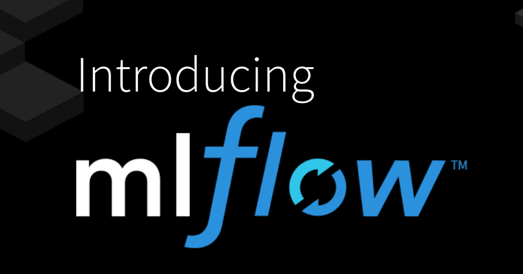
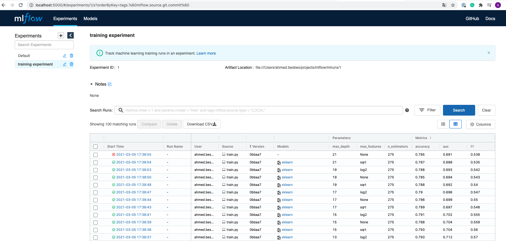
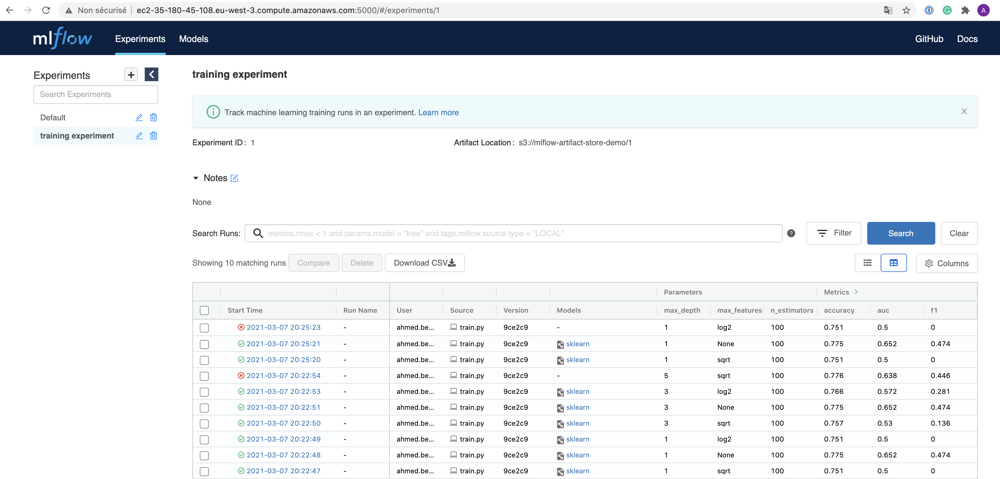
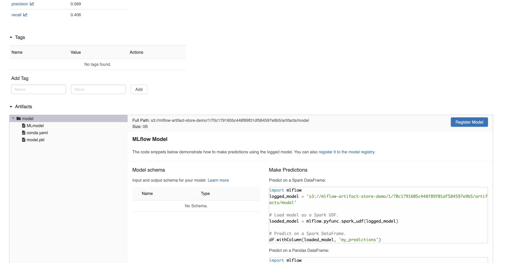
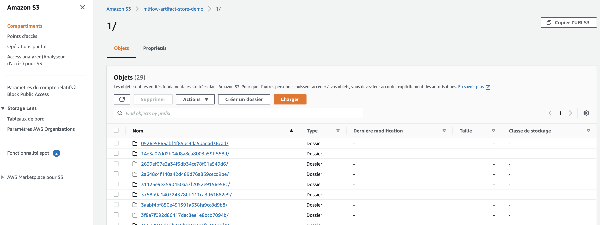

### How to use MLflow to manage the Machine Learning lifecycle



In this repo, I experiment with MLflow to:

- track machine learning experiments based on:

  - metrics
  - hyper-parameters
  - source scripts executing the run
  - code version
  - notes & comments

- compare different runs between each other
- set up a tracking server locally and on AWS
- deploy the your best model using MLflow Models

### Quickstart locally

To execute the code:

- Install pipenv to run a virtual environment with mlflow (it's cleaner this way)

```bash
pip install pipenv
```

- Clone the project

```bash
git clone git@github.com:ahmedbesbes/mlflow.git
```

- Install the dependencies

```bash
cd mlflow/
pipenv install .
```

- Start a tracking server locally

```bash
mlflow ui
```

- Launch the training

```bash
python train.py
```

- Visit http://localhost:5000 to check the runs on MLflow ui



### Launch a tracking server on AWS

#### 1. Prepare an EC2 machine and an S3 bucket

- create an IAM user on AWS. Get its credentials, namely `Access key ID` and `Secret access key`

- with this same user, create an s3 bucket to store future artifacts: give this bucket a name.
  Mine is `mlflow-artifact-store-demo` but you cannot pick it

- Launch an EC2 instance: it doesn't have to be big. a `t2.micro` eligible to free tier does perfectly the job

- Configure the security group of this instance to accept inbound http traffic on port 5000

- ssh into your EC2:

  - install pip
    ```bash
    sudo apt update
    sudo apt install python3-pip
    ```
  - install pipenv

    ```bash
    sudo pip3 install pipenv
    sudo pip3 install virtualenv

    export PATH=$PATH:/home/[your_user]/.local/bin/
    ```

- now with pipenv, install the dependencies to run the mlflow server

  ```bash
  pipenv install mlflow
  pipenv install awscli
  pipenv install boto3
  ```

- on the EC2 machine, configure aws with user's crendentials so that the tracking server can have access to s3 and display the artifacts on the UI.

  enter `aws configure` then follow the instructions to enter the credentials

- start an mlflow server on the EC2 instance by defining the host as `0.0.0.0` and the `--default-artifact-root` as the S3 bucket

  ```shell
  mlflow server -h 0.0.0.0  \
                --default-artifact-root s3://mlflow-artifact-store-demo
  ```

#### 2. Set AWS credentials and change the tracking URI and

- set the AWS credentials as environment variables so that the code uploads artifacts to the s3 bucket

  ```shell
  export AWS_ACCESS_KEY_ID=<your-aws-access-key-id>
  export AWS_SECRET_ACCESS_KEY = <your-aws-secret-access-key>
  ```

- change the tracking URI to the public dns of your EC2 machine + port 5000

  In my case the tracking URI was: http://ec2-35-180-45-108.eu-west-3.compute.amazonaws.com:5000/

Now you everything should be be good: after running the script locally you can inspect metrics on the UI that run on the remote server



By clicking on a specific run, you can see its artifacts uploaded to S3.



In fact, these artifacts are effectively on S3.



### Slides

- French [version](https://docs.google.com/presentation/d/1wAZnpVB9tINqZVrMP0Am3BwBgZrFRosgyIzhZ9p9In4/edit?usp=sharing)
- English version (coming soon)
